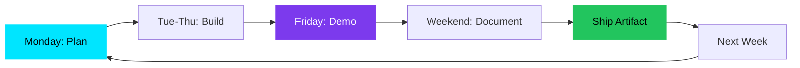

<div align="center">

<!-- Animated gradient header -->


<!-- Typing animation for tagline -->
<a href="https://git.io/typing-svg"></a>

<br/>

<!-- Social badges with glow effect -->
[](https://github.com/LLParis)
[](https://twitter.com/ggen5v)
[](https://github.com/LLParis)

</div>

<br/>

## 🎯 Mission Vector

```python
class ResearchJourney:
    def __init__(self):
        self.origin = "fundamentals"
        self.target = "UW_GRAIL_caliber_work"
        self.method = "weekly_proof_of_work"
        
    def focus_areas(self):
        return {
            "graphics_gen_ai": ["stylization", "controllability", "temporal_consistency"],
            "procedural_gen": ["code_driven_worlds", "constraint_systems", "variation"],
            "simulation_eval": ["reproducible_experiments", "eval_harnesses", "benchmarks"],
            "long_horizon": ["memory_systems", "planning", "multi_step_execution"]
        }
```

<br/>

## 🚀 Active Repositories

<table>
<tr>
<td width="50%" valign="top">

### 🔧 [python-foundations-lab](https://github.com/LLParis/python-foundations-lab)
```yaml
status: 🟡 In Progress
purpose: Core Python + upgraded projects
stack: [Python, pytest, black]
```
**Building**: Clean code practices, testing, documentation

</td>
<td width="50%" valign="top">

### 📝 [receipt-cli](https://github.com/LLParis/receipt-cli)
```yaml
status: 🟢 Active
purpose: CLI tool for receipt management
stack: [Python, Click, SQLite]
```
**Shipping**: Real-world tool promoted from coursework

</td>
</tr>

<tr>
<td width="50%" valign="top">

### 🌍 [procgen-sim-lab](https://github.com/LLParis/procgen-sim-lab)
```yaml
status: 🔵 Planned Q1 2026
purpose: Procedural generation experiments
stack: [Python, Blender, NumPy]
```
**Next**: World generation, constraint solving

</td>
<td width="50%" valign="top">

### 📊 [eval-benchmarks-lab](https://github.com/LLParis/eval-benchmarks-lab)
```yaml
status: 🔵 Planned Q1 2026
purpose: Reproducible evaluation frameworks
stack: [Python, pytest, wandb]
```
**Next**: Benchmark harnesses, ablation studies

</td>
</tr>

<tr>
<td width="50%" valign="top">

### 🤖 [longterm-agent-lab](https://github.com/LLParis/longterm-agent-lab)
```yaml
status: 🔵 Planned Q2 2026
purpose: Memory + multi-step planning
stack: [Python, LangChain, Vector DB]
```
**Next**: Persistent memory, goal decomposition

</td>
<td width="50%" valign="top">

### 📈 Weekly Progress Tracker
```yaml
current_week: Week 1
demos_shipped: 0
commits_this_week: building
next_milestone: First demo clip
```
**Commitment**: Demo + commits + log every week

</td>
</tr>
</table>

<br/>

## 💻 Technology Stack

<div align="center">

### Core Development


### Graphics & Simulation


### ML & AI


</div>

<br/>

## 📊 Development Metrics

<div align="center">


</div>

<br/>

## 🎯 Weekly Execution Protocol



<div align="center">

**Protocol**: `Plan → Build → Demo → Document → Ship → Repeat`

Every week delivers tangible proof of progress

</div>

<br/>

## 🔬 Research Philosophy

<div align="center">

```ascii
╔══════════════════════════════════════════════════════════════╗
║                                                              ║
║   "Proof beats hype. Ship weekly. Build in public.          ║
║    Document everything. Let the work speak."                 ║
║                                                              ║
║   → No inflated claims                                       ║
║   → No borrowed credibility                                  ║
║   → Just consistent execution toward complex systems         ║
║                                                              ║
╚══════════════════════════════════════════════════════════════╝
```

<br/>

### 🎯 Current Phase: **Foundation Building**
### 🚀 Next Phase: **Procedural Generation Systems**
### 🌟 Target: **Research-Grade Simulation & Long-Horizon Agents**

<br/>

---


**[⬆ back to top](#llparis)**

</div>
