<div align="center">

<!-- Cyberpunk wave header with particle effect -->


<!-- Multi-line typing animation with neon effect -->
<a href="https://git.io/typing-svg">
  

</a>

<br/>

<!-- Animated profile views counter -->


<!-- Premium social badges with glow -->
<p>
  <a href="https://github.com/LLParis">
    
  </a>
  <a href="https://twitter.com/ggen5v">
    
  </a>
  
  
</p>

</div>

---

<br/>

<div align="center">

## 🌌 MISSION VECTOR

</div>

```python
"""
LLParis Research Pipeline v1.0
Building foundations → Research-grade systems
"""

class ResearchTrajectory:
    """Journey from fundamentals to GRAIL-caliber work"""
    
    def __init__(self):
        self.current_position = "foundation_building"
        self.target_destination = "uw_grail_research_quality"
        self.execution_model = "weekly_proof_of_work"
        self.philosophy = "ship > talk"
        
    @property
    def focus_matrix(self) -> dict:
        """Multi-dimensional research focus areas"""
        return {
            "graphics_x_gen_ai": {
                "stylization": ["controllable", "consistent", "real_time"],
                "temporal": ["frame_coherence", "motion", "transitions"],
                "pipeline": ["preprocessing", "inference", "postprocessing"]
            },
            "procedural_generation": {
                "worlds": ["terrain", "architecture", "vegetation"],
                "constraints": ["physical", "aesthetic", "narrative"],
                "systems": ["modular", "parameterized", "hierarchical"]
            },
            "simulation_benchmarks": {
                "evaluation": ["reproducible", "ablatable", "interpretable"],
                "metrics": ["performance", "quality", "robustness"],
                "harness": ["automated", "scalable", "versioned"]
            },
            "long_horizon_agents": {
                "memory": ["episodic", "semantic", "procedural"],
                "planning": ["hierarchical", "multi_step", "adaptive"],
                "execution": ["goal_decomposition", "error_recovery", "learning"]
            }
        }
    
    def weekly_protocol(self) -> list:
        """Execution cadence for consistent progress"""
        return [
            "monday: plan_objectives_and_milestones()",
            "tue_thu: execute_build_test_iterate()",
            "friday: create_demo_clip_and_document()",
            "weekend: write_progress_log_and_reflect()",
            "ship: publish_artifact_to_public_repo()"
        ]

# Initialize journey
journey = ResearchTrajectory()
assert journey.philosophy == "ship > talk", "Proof beats hype"
```

<br/>

---

<div align="center">


## 🚀 ACTIVE RESEARCH REPOSITORIES

</div>

<table>
<tr>
<td width="50%" valign="top">

<div align="center">

### ⚡ [python-foundations-lab](https://github.com/LLParis/python-foundations-lab)


</div>

```yaml
phase: foundation_building
sprint: weeks 1-8
stack:
  - Python 3.11+
  - pytest + coverage
  - black + ruff
  - type hints + mypy

objectives:
  - Clean code patterns
  - Test-driven development  
  - Documentation standards
  - CLI tool design

deliverables:
  - Upgraded course projects
  - Code quality pipeline
  - Testing framework
  - Style guide adherence
```

**Current**: Building muscle memory for production-quality Python

</td>
<td width="50%" valign="top">

<div align="center">

### ⚡ [receipt-cli](https://github.com/LLParis/receipt-cli)


</div>

```yaml
phase: real_world_tool
sprint: promoted_from_coursework
stack:
  - Python Click framework
  - SQLite database
  - Rich terminal UI
  - Pytest test suite

features:
  - Receipt capture & parsing
  - Category management
  - Expense tracking
  - Export to CSV/JSON

metrics:
  - Unit test coverage: 85%+
  - CLI commands: 12+
  - Database migrations: v3
  - Active users: dogfooding
```

**Status**: Production tool, actively maintained, user feedback loop

</td>
</tr>

<tr>
<td width="50%" valign="top">

<div align="center">

### 🌍 [procgen-sim-lab](https://github.com/LLParis/procgen-sim-lab)


</div>

```yaml
phase: procedural_systems
sprint: planned_q1_2026
stack:
  - Python + NumPy/SciPy
  - Blender Python API
  - Perlin/Simplex noise
  - Constraint solvers

research_threads:
  - Terrain generation algorithms
  - Architecture grammar systems
  - Biome distribution models
  - Constraint-based placement

experiments:
  - Wave Function Collapse
  - L-systems for vegetation
  - PCG via ML guidance
  - Multi-scale coherence

milestones:
  - Week 1: Terrain heightmaps
  - Week 4: Building placement
  - Week 8: Full scene pipeline
  - Week 12: Benchmark suite
```

**Next**: Parameterized world generation with measurable variation

</td>
<td width="50%" valign="top">

<div align="center">

### 📊 [eval-benchmarks-lab](https://github.com/LLParis/eval-benchmarks-lab)


</div>

```yaml
phase: reproducible_science
sprint: planned_q1_2026
stack:
  - Python pytest framework
  - Weights & Biases logging
  - Docker containers
  - Git LFS for datasets

benchmark_types:
  - Procedural generation quality
  - Simulation performance
  - Agent task completion
  - Temporal consistency

infrastructure:
  - Automated test harness
  - Result visualization
  - Ablation study tools
  - Version control for data

deliverables:
  - 5+ reproducible benchmarks
  - Standardized metrics
  - Comparison framework
  - Public leaderboard
```

**Goal**: Make experiments reproducible, ablatable, and sharable

</td>
</tr>

<tr>
<td width="50%" valign="top">

<div align="center">

### 🤖 [longterm-agent-lab](https://github.com/LLParis/longterm-agent-lab)


</div>

```yaml
phase: agentic_systems
sprint: planned_q2_2026
stack:
  - Python async framework
  - Vector databases (Chroma/Pinecone)
  - LangChain/LlamaIndex
  - Redis for state management

capabilities:
  - Persistent memory systems
  - Goal decomposition
  - Multi-step planning
  - Tool use orchestration

research_areas:
  - Episodic memory retrieval
  - Hierarchical planning
  - Error recovery strategies
  - Long-context reasoning

experiments:
  - Memory consolidation
  - Plan refinement loops
  - Multi-agent coordination
  - Evaluation on SWE-bench
```

**Vision**: Agents that can execute multi-day tasks with memory

</td>
<td width="50%" valign="top">

<div align="center">

### 📈 [weekly-progress-tracker](https://github.com/LLParis/weekly-logs)


</div>

```yaml
commitment: weekly_artifacts
format: demo_clip + commits + log
transparency: build_in_public

week_template:
  monday:
    - Set objectives
    - Define success criteria
  
  tue_thu:
    - Execute build sprint
    - Test and iterate
    - Document decisions
  
  friday:
    - Create demo clip
    - Write progress log
    - Commit all changes
  
  weekend:
    - Reflect and plan
    - Update roadmap
    - Prepare next week

accountability:
  - Every week ships something
  - No skipped weeks
  - Public progress logs
  - Commit graph integrity
```

**Protocol**: Consistent weekly execution, publicly documented

</td>
</tr>
</table>

<br/>

---

<div align="center">


## 💻 TECHNOLOGY STACK & TOOLCHAIN

</div>

<table>
<tr>
<td width="33%" valign="top">

<div align="center">

### ⚡ Core Development


</div>

</td>
<td width="33%" valign="top">

<div align="center">

### 🎨 Graphics & Simulation


</div>

</td>
<td width="33%" valign="top">

<div align="center">

### 🧠 ML & AI Stack


</div>

</td>
</tr>
</table>

<br/>

---

<div align="center">


## 📊 DEVELOPMENT METRICS & ACTIVITY

</div>

<div align="center">


<!-- Animated contribution snake -->
<picture>
  <source media="(prefers-color-scheme: dark)" srcset="https://raw.githubusercontent.com/LLParis/LLParis/output/github-contribution-grid-snake-dark.svg">
  <source media="(prefers-color-scheme: light)" srcset="https://raw.githubusercontent.com/LLParis/LLParis/output/github-contribution-grid-snake.svg">
  
</picture>

<!-- Trophy display -->


</div>

<br/>

---

<br/>

<div align="center">

## 🎯 WEEKLY EXECUTION PROTOCOL

```mermaid
%%{init: {'theme':'dark', 'themeVariables': { 'primaryColor':'#00E5FF','primaryTextColor':'#fff','primaryBorderColor':'#7C3AED','lineColor':'#22C55E','secondaryColor':'#0b1220','tertiaryColor':'#1f2937'}}}%%
graph TB
    A[🎯 Monday: Plan Sprint] --> B[💻 Tue-Thu: Execute & Build]
    B --> C[🎬 Friday: Create Demo]
    C --> D[📝 Weekend: Document & Reflect]
    D --> E[🚀 Ship Artifact]
    E --> F[📊 Update Metrics]
    F --> G[🔄 Next Week Sprint]
    G --> A
    
    style A fill:#00E5FF,stroke:#00E5FF,stroke-width:3px,color:#000
    style C fill:#7C3AED,stroke:#7C3AED,stroke-width:3px,color:#fff
    style E fill:#22C55E,stroke:#22C55E,stroke-width:3px,color:#000
    style G fill:#FFB800,stroke:#FFB800,stroke-width:3px,color:#000
```

</div>



<br/>

<div align="center">

### 📋 Execution Framework

</div>

<table>
<tr>
<td width="20%" align="center">

**MONDAY**
<br/>🎯
<br/><br/>
Plan objectives
<br/>
Define success
<br/>
Set milestones

</td>
<td width="20%" align="center">

**TUE-THU**
<br/>💻
<br/><br/>
Execute sprint
<br/>
Build features
<br/>
Test & iterate

</td>
<td width="20%" align="center">

**FRIDAY**
<br/>🎬
<br/><br/>
Create demo
<br/>
Screen record
<br/>
Document code

</td>
<td width="20%" align="center">

**WEEKEND**
<br/>📝
<br/><br/>
Write log
<br/>
Reflect deeply
<br/>
Plan next week

</td>
<td width="20%" align="center">

**SHIP**
<br/>🚀
<br/><br/>
Push commits
<br/>
Publish artifact
<br/>
Update README

</td>
</tr>
</table>

<br/>

<div align="center">

**CORE PRINCIPLE**: `Every week delivers tangible proof of progress`

No skipped weeks. No excuses. Just consistent execution.

</div>

<br/>

---

<br/>

<div align="center">

## 🔬 RESEARCH PHILOSOPHY & ETHOS

</div>

```ascii
╔═══════════════════════════════════════════════════════════════════════════╗
║                                                                           ║
║                        ⚡ PROOF BEATS HYPE ⚡                             ║
║                                                                           ║
║   "Ship weekly. Build in public. Document everything.                    ║
║    Let the work speak louder than claims."                               ║
║                                                                           ║
║   ┌─────────────────────────────────────────────────────────────┐       ║
║   │  ✗  No inflated claims about capabilities                   │       ║
║   │  ✗  No borrowed credibility or name-dropping                │       ║
║   │  ✗  No vaporware promises or future projections             │       ║
║   │                                                              │       ║
║   │  ✓  Weekly artifacts as proof of progress                   │       ║
║   │  ✓  Public documentation of all decisions                   │       ║
║   │  ✓  Reproducible experiments and open benchmarks            │       ║
║   │  ✓  Consistent execution over flashy announcements          │       ║
║   └─────────────────────────────────────────────────────────────┘       ║
║                                                                           ║
║   The only metric that matters: did you ship this week?                  ║
║                                                                           ║
╚═══════════════════════════════════════════════════════════════════════════╝
```

<br/>

<div align="center">

### 🎯 PROGRESSION ROADMAP

</div>


<br/>

<table>
<tr>
<td width="25%" align="center">

### 🟢 CURRENT
**Foundation**
<br/><br/>
Building core skills
<br/>
Python mastery
<br/>
Tool development
<br/>
Testing & docs

</td>
<td width="25%" align="center">

### 🟡 NEXT
**Procedural Gen**
<br/><br/>
World generation
<br/>
Constraint systems
<br/>
Parameterization
<br/>
Quality metrics

</td>
<td width="25%" align="center">

### 🔵 HORIZON
**Simulation**
<br/><br/>
Eval harnesses
<br/>
Benchmarks
<br/>
Ablations
<br/>
Reproducibility

</td>
<td width="25%" align="center">

### 🟣 TARGET
**GRAIL Level**
<br/><br/>
Long-horizon agents
<br/>
Memory systems
<br/>
Research quality
<br/>
Novel contributions

</td>
</tr>
</table>

<br/>

---

<br/>

<div align="center">

## 🎨 VISUAL SHOWCASE

</div>

<div align="center">

<!-- Placeholder for demo clips and screenshots -->
<p align="center">
  

</p>

<br/><br/>

<table>
<tr>
<td width="33%" align="center">

<br/><b>Procedural Terrain</b>
<br/><i>Q1 2026</i>
</td>
<td width="33%" align="center">

<br/><b>Benchmark Suite</b>
<br/><i>Q1 2026</i>
</td>
<td width="33%" align="center">

<br/><b>Long-Horizon Agent</b>
<br/><i>Q2 2026</i>
</td>
</tr>
</table>

<br/>

> **Note**: Visuals will be populated as weekly artifacts ship. Each demo includes:
> - 🎬 Screen recording (30-60s)
> - 📝 Technical breakdown
> - 💻 Code snippets
> - 🎓 Lessons learned

</div>

<br/>

---

<br/>

<div align="center">

## 📚 LEARNING & RESOURCES

</div>

<details>
<summary><b>📖 Current Reading List</b></summary>
<br/>

**Graphics & Procedural Generation**
- *Procedural Content Generation in Games* (Shaker, Togelius, Nelson)
- *GPU Gems* series
- *Real-Time Rendering* (4th Edition)

**Simulation & Benchmarks**
- *The Scientist and Engineer's Guide to Digital Signal Processing*
- Academic papers on evaluation methodology
- Benchmark design patterns from ML conferences

**AI & Agents**
- *Artificial Intelligence: A Modern Approach* (Russell & Norvig)
- ReAct, Reflexion, and planning papers
- Long-context reasoning research

</details>

<details>
<summary><b>🎓 Skills Development Path</b></summary>
<br/>

```yaml
completed:
  - Python fundamentals
  - Git version control
  - Linux command line
  - Basic 3D graphics concepts

in_progress:
  - Advanced Python patterns
  - Test-driven development
  - Blender Python API
  - NumPy/SciPy proficiency

next_quarter:
  - Procedural generation algorithms
  - Constraint satisfaction
  - Performance profiling
  - Benchmark design

future:
  - Reinforcement learning
  - Vector databases
  - Distributed systems
  - Research paper writing
```

</details>

<details>
<summary><b>🔗 Useful Links & Tools</b></summary>
<br/>

**Development Tools**
- [Python Official Docs](https://docs.python.org/3/)
- [Real Python Tutorials](https://realpython.com/)
- [Blender API Reference](https://docs.blender.org/api/current/)

**Graphics Resources**
- [Learn OpenGL](https://learnopengl.com/)
- [Three.js Journey](https://threejs-journey.com/)
- [Scratchapixel](https://www.scratchapixel.com/)

**Research References**
- [Papers With Code](https://paperswithcode.com/)
- [Hugging Face](https://huggingface.co/)
- [arXiv CS sections](https://arxiv.org/)

</details>

<br/>

---

<br/>

<div align="center">

## 🤝 COLLABORATION & CONTACT

</div>

<div align="center">

**Open to collaboration on:**
- Procedural generation research
- Benchmark development
- Open-source graphics tools
- Long-horizon agent experiments

<br/>

**Best ways to reach:**
<br/><br/>
[](https://github.com/LLParis)
[](https://twitter.com/ggen5v)
[](mailto:your.email@example.com)

<br/>

**Response time**: Usually within 24-48 hours. I prioritize:
1. Technical discussions about active projects
2. Collaboration proposals with clear scope
3. Bug reports and feature requests
4. Learning resources and paper recommendations

</div>

<br/>

---

<br/>

<div align="center">

## ⚡ FINAL WORD

</div>

<div align="center">

```ascii
┌────────────────────────────────────────────────────────────────┐
│                                                                │
│  This profile documents a journey from zero to research-grade  │
│  capabilities in procedural generation, simulation, and        │
│  long-horizon AI agents.                                       │
│                                                                │
│  No shortcuts. No inflated claims. Just consistent weekly      │
│  execution, public documentation, and tangible artifacts.      │
│                                                                │
│  The commit graph tells the story. The repos contain proof.    │
│  The weekly logs show the process.                             │
│                                                                │
│  Target: UW GRAIL caliber                                      │
│  Method: Ship > Talk                                           │
│  Timeline: Week by week                                        │
│                                                                │
│  Let's build something real.                                   │
│                                                                │
└────────────────────────────────────────────────────────────────┘
```

<br/>

### 🎯 Current Phase: **Week 1 - Foundation Building**
### 🚀 Next Milestone: **First Demo Clip + Progress Log**
### 🌟 Long-Term Goal: **Research-Quality Systems & Novel Contributions**

<br/>

---


<br/>

**[⬆ Back to Top](#llparis)** • Built with 💜 by LLParis • Last Updated: January 2026

</div>
